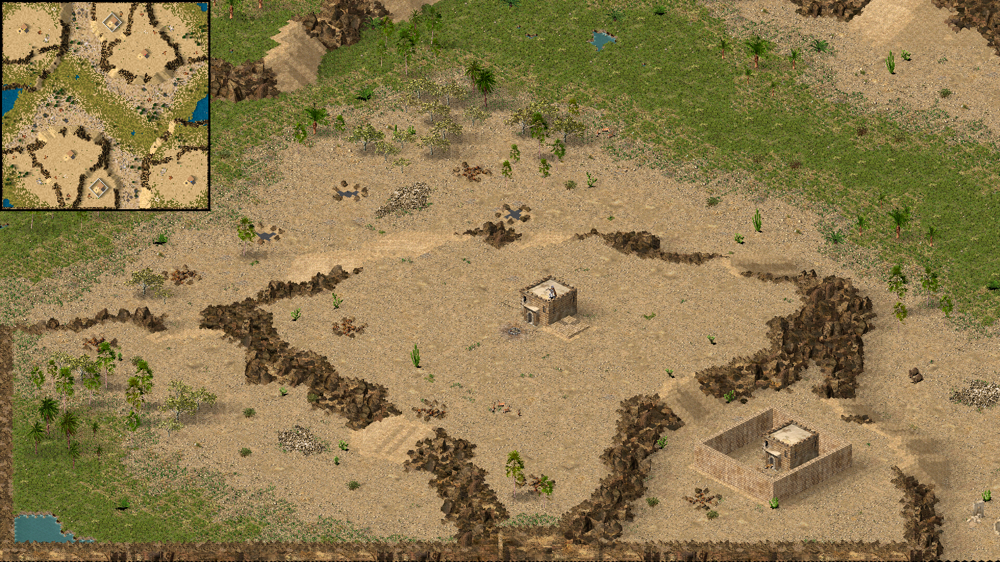

# Crusader Map Generator

Procedural map generator for Stronghold Crusader

## Installation and Usage

### Requirements

Windows 7 or newer, or Wine

Stronghold Crusader
- Only v1.41 and v1.41-E in latin-alphabet localizations are supported, other versions and localizations may not be compatible

### Setup

1. **Download the latest release**

   Make sure to choose the correct build for your system

   Extract the files anywhere on your PC

2. **Configure the generator**

   Edit the `config.txt` file in the program directory

   A default config is provided

   You may reorder variables and change their values freely, however every variable must exist and have a valid value

   The config is validated before each run with very lenient rules, it is still possible to set nonsensical values

   Documentation of variables is not provided, experiment with values to see how they affect the output

3. **Run the game**

   If automatic map saving is enabled, leave it in the main menu, otherwise create a new map in the map editor

4. **Run the generator**

   Administrator permissions are required

   Do not interact with the game while the generator is running, doing so may corrupt the output or crash the game

   If your antivirus quarantines the program, create an exception, restore or reinstall the executable if necessary

## Licensing and Attribution

See [LICENSE](https://github.com/Altaruss28/crusader-map-generator/blob/main/LICENSE)

Anything fully or partially created using this program must be clearly and prominently attributed in any distribution or publication

This project is not associated with or endorsed by Firefly Studios

## Contact

Discord: `altaruss28`
